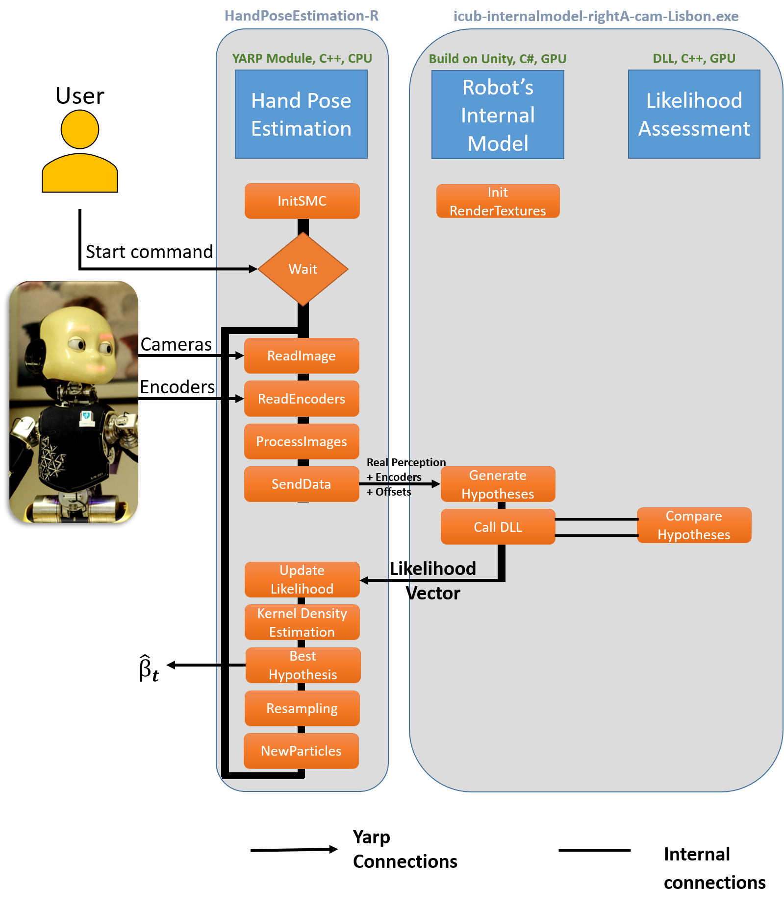
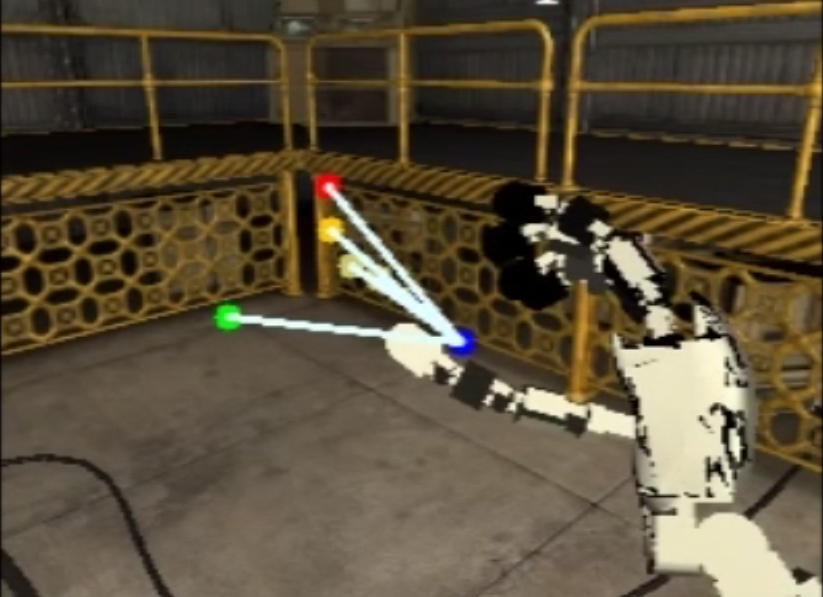
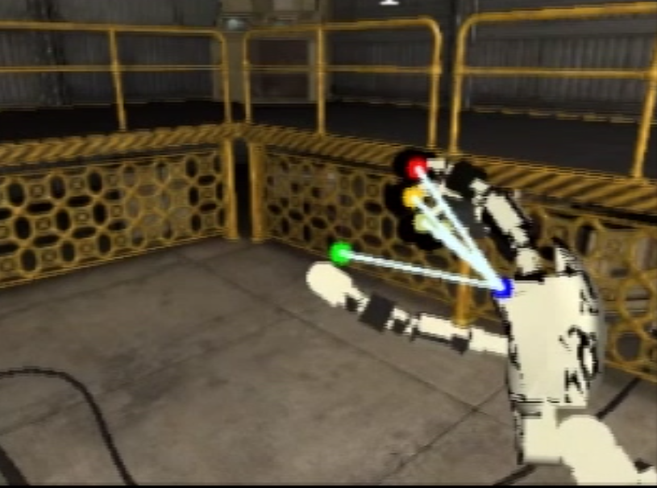

# Online Body Schema Adaptation & Markerless eye-hand kinematic calibration

We propose a markerless hand pose estimation software for the iCub humanoid robot. 
The agent can calibrate its eye-hand kinematic chain without any markers which, from a developmental psychology perspective, can be seen as a body schema adaptation.

#### Overview:
- [Repository Organization](#repository-organization)
- [Dependencies & how to install](#dependencies)
- [Running the Modules](#running-the-modules)
- [Results & Dataset](#results-and-dataset)
- [Documentation & more](#documentation)

## Repository Organization:
The code is divided into three logical components: i) the hand pose estimation, ii) the Robot’s Internal Model generator, and iii) the likelihood assessment, which are implemented, respectively, at the following repository locations:
- modules/handPoseEstimation:
   - include/handPoseEstimationModule.h
   - src/handPoseEstimationMain.cpp
   - src/handPoseEstimationModule.cpp
- modules/internalmodel:
   - icub-internalmodel-rightA-cam-Lisbon.exe
   - icub-internalmodel-leftA-cam-Lisbon.exe
- modules/likelihodAssessment:
   - src/Cuda_Gl.cu
   - src/likelihood.cpp

The software architecture implementing the proposed eye-hand calibration solution can be seen in the following picture:

  

[`Go to the top`](#online-body-schema-adaptation--markerless-eye-hand-kinematic-calibration)
## Dependencies
- HandPoseEstimation Module:
  - YARP
  - OpenCV (tested with v2.10 and v3.3)

- Likelihood Assessment Module:

  - Windows Machine
  - OpenCV (tested with v2.10)
  - CUDA ToolKit (tested with v6.5)
  - cmake-gui
  - Visual Studio (tested with VS10) or another C++/CUDA compiler

- Robot's Internal Model:
  - Windows Machine
  - Likelihood Assessment Module
  - YARP
  - YARP C# bindings [instructions](http://www.yarp.it/yarp_swig.html#yarp_swig_windows )

[`Go to the top`](#online-body-schema-adaptation--markerless-eye-hand-kinematic-calibration)

## How to install

Please refer to the documentation:

http://vicentepedro.github.io/Online-Body-Schema-Adaptation/doxygen/doc/html/installation.html

[`Go to the top`](#online-body-schema-adaptation--markerless-eye-hand-kinematic-calibration)

## Running the Modules

Please refer to the documentation:

http://vicentepedro.github.io/Online-Body-Schema-Adaptation/doxygen/doc/html/How_to_use.html

[`Go to the top`](#online-body-schema-adaptation--markerless-eye-hand-kinematic-calibration)
## Results and Dataset

The following figures show the projection of the fingertips on the left camera during simulated robot experiments. The  blue  dot represents the end-effector projection ( *i.e.*, base of the middle finger), the  red  represents the index fingertip, the  green  the thumb fingertip, the  dark yellow  the middle fingertip and the  light yellow the ring and little fingertips.
The first image (a) is the canonical projection (*i.e.*, with all angular offsets equal to zero) and on the second image (b) with the estimated offsets from the proposed method.

  

(a) Canonical Finger Projection - based on the encoders

  

(b) Corrected Finger Projection - based on the encoders and estimated angular Offsets

The simulated results presented here were acquired on the following Dataset:

[Dataset](https://github.com/vicentepedro/eyeHandCalibrationDataset-Sim)

[`Go to the top`](#online-body-schema-adaptation--markerless-eye-hand-kinematic-calibration)

# Documentation
http://vicentepedro.github.com/Online-Body-Schema-Adaptation 

[`Go to the top`](#online-body-schema-adaptation--markerless-eye-hand-kinematic-calibration)

# References

If you use this code please cite the following reference(s):

    @ARTICLE{10.3389/frobt.2016.00007,
    AUTHOR={Vicente, Pedro  and  Jamone, Lorenzo  and  Bernardino, Alexandre},
    TITLE={Online body schema adaptation based on internal mental simulation and multisensory feedback},
    JOURNAL={Frontiers in Robotics and AI},
    VOLUME={3},
    YEAR={2016},
    NUMBER={7},
    DOI={10.3389/frobt.2016.00007},
    ISSN={2296-9144}
    
    @ARTICLE{10.3389/frobt.2018.00046,
    AUTHOR={Vicente, Pedro and Jamone, Lorenzo and Bernardino, Alexandre},   
    TITLE={Markerless Eye-Hand Kinematic Calibration on the iCub Humanoid Robot},      
    JOURNAL={Frontiers in Robotics and AI},      
    VOLUME={5},     
    PAGES={46},     
    YEAR={2018},       
    DOI={10.3389/frobt.2018.00046},     
    ISSN={2296-9144},   
}
    
The full articles can be found:
[here](https://doi.org/10.3389/frobt.2016.00007)
and
[here](https://doi.org/10.3389/frobt.2018.00046)

[`Go to the top`](#online-body-schema-adaptation--markerless-eye-hand-kinematic-calibration)
