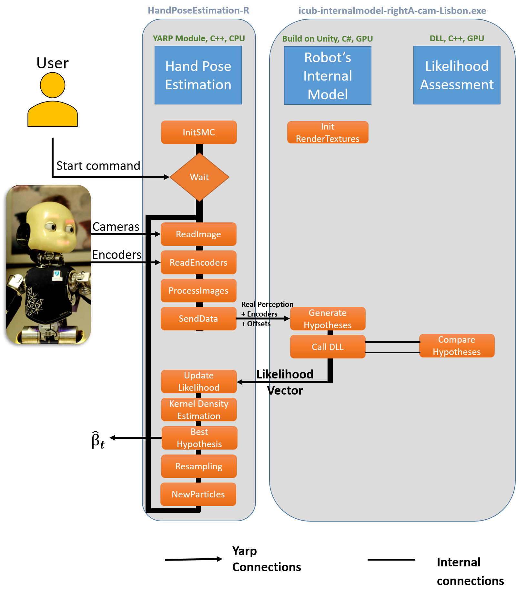
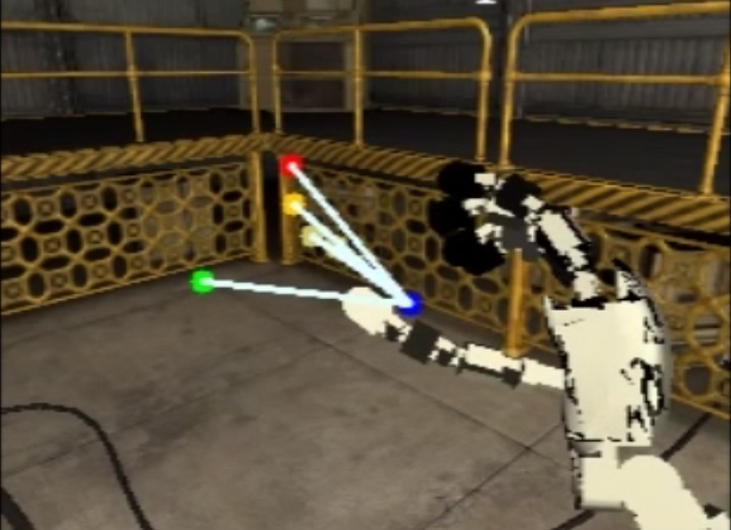
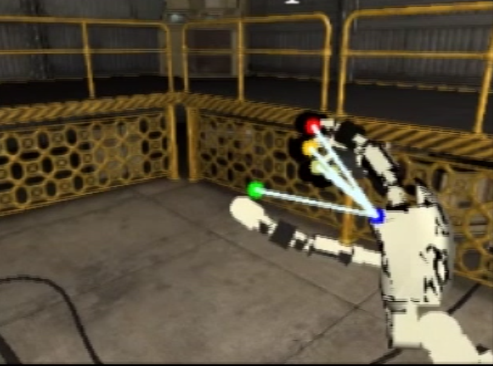

# Online Body Schema Adaptation & Markerless eye-hand kinematic calibration

We propose a markerless hand pose estimation software for the iCub humanoid robot. 
The agent can calibrate its eye-hand kinematic chain without any markers which, from a developmental psychology perspective, can be seen as a body schema adaptation.

#### Overview:
- [Repository Organization](#repository-organization)
- [Dependencies & how to install](#dependencies)
- [Running the Modules](#running-the-modules)
- [Results & Dataset](#results-and-dataset)
- [Documentaion & more](#documentation)

## Repository Organization:
The code is divided into three logical components: i) the hand pose estimation, ii) the Robot’s Internal Model generator, and iii) the likelihood assessment, which are implemented, respectively, at the following repository locations:
### modules/handPoseEstimation:
   - include/handPoseEstimationModule.h
   - src/handPoseEstimationMain.cpp
   - src/handPoseEstimationModule.cpp
### modules/internalmodel:
   - icub-internalmodel-rightA-cam-Lisbon.exe
   - icub-internalmodel-leftA-cam-Lisbon.exe
### modules/likelihodAssessment:
   - src/Cuda_Gl.cu
   - src/likelihood.cpp

The software architecture implementing the proposed eye-hand calibration solution can be seen in the following picture:

<p align="center" >  </p>

[`Go to the top`](#online-body-schema-adaptation--markerless-eye-hand-kinematic-calibration)
## Dependencies
- HandPoseEstimation Module:
  - YARP
  - OpenCV (tested with v2.10 and v3.3)

- Likelihood Assessment Module:

  - Windows Machine
  - OpenCV (tested with v2.10)
  - CUDA ToolKit (tested with v6.5)
  - cmake-gui
  - Visual Studio (tested with VS10) or another C++/CUDA compiler

- Robot's Internal Model:
  - Windows Machine
  - Likelihood Assessment Module
  - YARP
  - YARP C# bindings [intructions](http://www.yarp.it/yarp_swig.html#yarp_swig_windows )

[`Go to the top`](#online-body-schema-adaptation--markerless-eye-hand-kinematic-calibration)

## How to install

- HandPoseEstimation Module:
  - On the folder:
    
    /modules/handPoseEstimation

  - Run the following commands:
    ``` bash
    $ mkdir build && cd build 

    $ ccmake .. 
    ```
  - Press c (twice) and, if no error occurs, press g do generate.
  - Exit cmake and then type:
    ``` bash
    $ make 
    ```
- Likelihood Assessment Module:
  - Open the cmake-gui executable
    - On the section:

      `where is the source code `

      insert the path (absolute path):

      /Online-Body-Schema-Adaptation/modules/likelihoodAssessment 
    - On the section:

      `where to build the binaries`

      insert the path (absolute path):

      /Online-Body-Schema-Adaptation/modules/likelihoodAssessment/build 

      and press the configure button, choosing your the 32 bit version of your compiler.

      The variable `CUDA_SDK_ROOT_DIR` will appear and should point to:

      C:\ProgramData\NVIDIA Corporation\CUDA Samples\v6.5\common 

      or similar, according to the CUDA version installed.

    - Press the Generate Button

  - Open the CUDAcompareEdge2.sln project (which is inside the build folder) 
    - choose Release version
    - set CudacompareEdge2 as the Startup project
    - and build the project.

    You should have now a CudacompareEdge2.dll file inside the Release folder.

- Robot's Internal Model:
  - One can use the compile version (icub-internalmodel-rightA-cam-Lisbon)
  - After compiling the YARP c# bindings, copy the `yarp.dll` to the folder:

    /modules/internalmodel/icub-internalmodel-rightA-cam-Lisbon_Data/Plugins/ 
  - copy also the `CudacompareEdge2.dll` to the above-mentioned folder.

[`Go to the top`](#online-body-schema-adaptation--markerless-eye-hand-kinematic-calibration)

## Running the Modules

Please refer to the documention:

http://vicentepedro.github.io/Online-Body-Schema-Adaptation/doxygen/doc/html/How_to_use.html

[`Go to the top`](#online-body-schema-adaptation--markerless-eye-hand-kinematic-calibration)
## Results and Dataset

In the following figures can be seen the projection of the fingertips on the left camera on simulated robot experiments. The <font color="blue"> blue </font> dot represents the end-effector projection (i.e. base of the middle finger), the  <font color="red">red </font> represents the index fingertip, the <font color="gree"> green </font> the thumb fingertip, the <font color="gold"> dark yellow </font> the middle fingertip and the <font color="Khaki"> soft yellow </font>the ring and little fingertips.
On the left image (a) is the canonical projection (i.e with $\hat{\BETA} = 0$) and on the right image (b) the estimated offsets
<p align="center" >  </p>
<p align="center" >Canonical Finger Projection - based on the encoders</p>
<p align="center" >  </p>
<p align="center" >Corrected Finger Projection - based on the encoders and estimated angular Offsets</p>

The simulated results presented here were acquired on the following Dataset:

[Dataset](https://github.com/vicentepedro/eyeHandCalibrationDataset-Sim)

[`Go to the top`](#online-body-schema-adaptation--markerless-eye-hand-kinematic-calibration)

# Documentation
http://vicentepedro.github.com/Online-Body-Schema-Adaptation 

[`Go to the top`](#online-body-schema-adaptation--markerless-eye-hand-kinematic-calibration)

# Final notes

The internal model module only runs on windows machines.

For more details see the following references:

    @ARTICLE{10.3389/frobt.2016.00007,
    AUTHOR={Vicente, Pedro  and  Jamone, Lorenzo  and  Bernardino, Alexandre},
    TITLE={Online body schema adaptation based on internal mental simulation and multisensory feedback},
    JOURNAL={Frontiers in Robotics and AI},
    VOLUME={3},
    YEAR={2016},
    NUMBER={7},
    DOI={10.3389/frobt.2016.00007},
    ISSN={2296-9144}
    
The full article can be found [here](https://doi.org/10.3389/frobt.2016.00007)

[`Go to the top`](#online-body-schema-adaptation--markerless-eye-hand-kinematic-calibration)